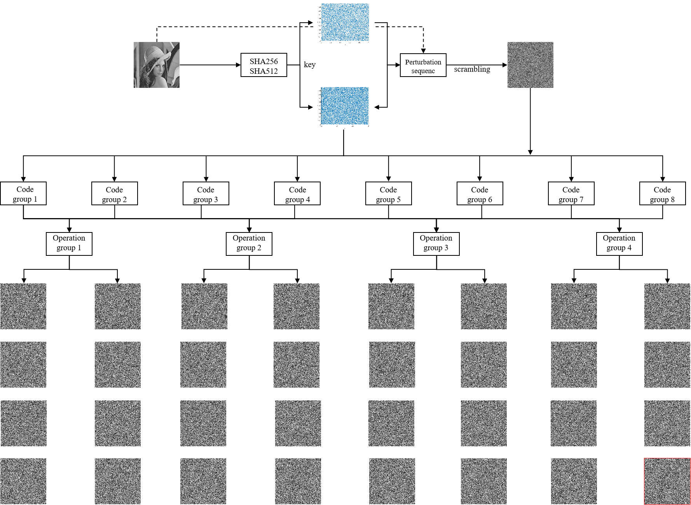

# StableImageCrypt
An image encryption algorithm based on chaotic jumping and parallel encoding.

[**Paper**](https://ieeexplore.ieee.org/stamp/stamp.jsp?tp=&arnumber=10242097) | [**Project Page**](https://github.com/yingtian22/StableImageCrypt)

> 🚧 Our code is currently being cleaned up and will be released soon. Stay tuned!

---

## 📝 Brief

This project implements a novel **image encryption algorithm** that addresses the limitations of traditional chaotic systems. While low-dimensional chaotic systems suffer from limited key space and weak security, and high-dimensional ones are too complex and inefficient, this method introduces a **stable and secure alternative**.

Key innovations include:
- **Chaotic Jumping Mechanism**: Utilizes random switching between two uncorrelated 1D chaotic maps to eliminate linear correlations.
- **Parallel DNA Encoding Groups**: Dynamically forms encoding groups and executes multiple encryption results in parallel.
- **Stability-Driven Optimization**: Selects the most stable ciphertext output from multiple candidates to reduce instability.
- **High Security and Robustness**: Demonstrates strong resistance to plaintext attacks and suitability across diverse image types and sizes.

This approach achieves **enhanced security**, **high sensitivity to input**, and strong **applicability in real-world image encryption scenarios**.

### 🔐 Overall Encryption Process

The image encryption workflow is illustrated in the diagram below.



The process consists of the following stages:

1. **Hashing**: Two hashing methods are applied to the plaintext image to generate unique and sensitive initial values.
2. **Key Generation**: The hash outputs are used to embed a key into two **expanded one-dimensional chaotic systems**.
3. **Scrambling (PORJ)**: Using the proposed **Parallel One-dimensional Random Jumping (PORJ)** algorithm, the image is spatially scrambled to destroy recognizable structure.
4. **Diffusion (DEOB)**: Multiple ciphertexts are generated in parallel via **Dynamic Encoding and Optimal Bit-selection (DEOB)** diffusion.
5. **Selection**: From the candidate ciphertexts, the algorithm selects the most **stable and secure output**, ensuring high resistance to cryptanalysis and minimizing encryption instability.

This method combines **chaotic dynamics, parallel encoding**, and **adaptive selection** to deliver robust, non-crackable image encryption suitable for diverse applications.


## 📄 How to Cite

If you use this work in your research, please cite the following paper:

```bibtex
@article{zhang2023stable,
  title={Stable image encryption algorithm based on expanded one-dimensional chaotic jumping and parallel encoding operation grouping},
  author={Zhang, Tianshuo and Ma, Yiqun},
  journal={IEEE Access},
  volume={11},
  pages={108746--108760},
  year={2023},
  publisher={IEEE}
}
```
